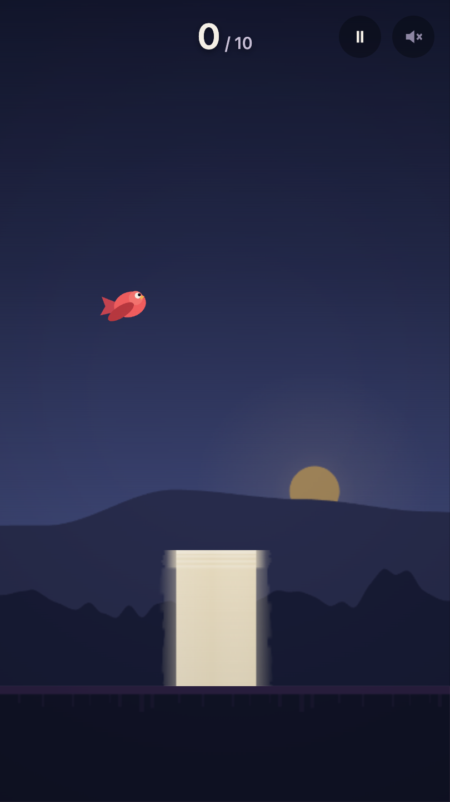
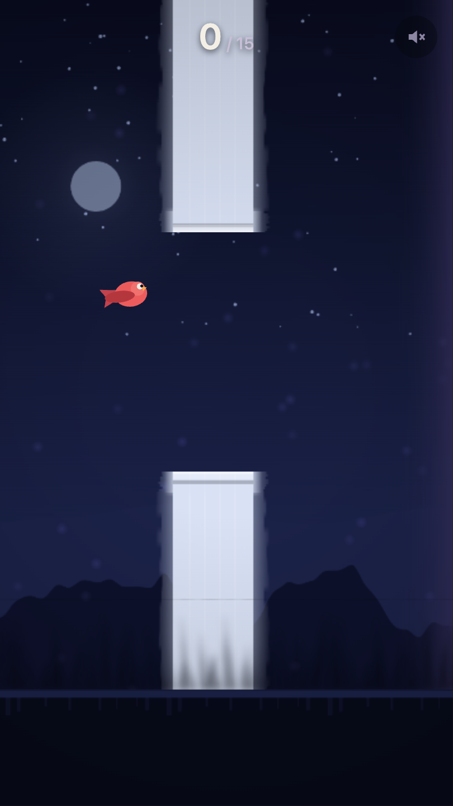
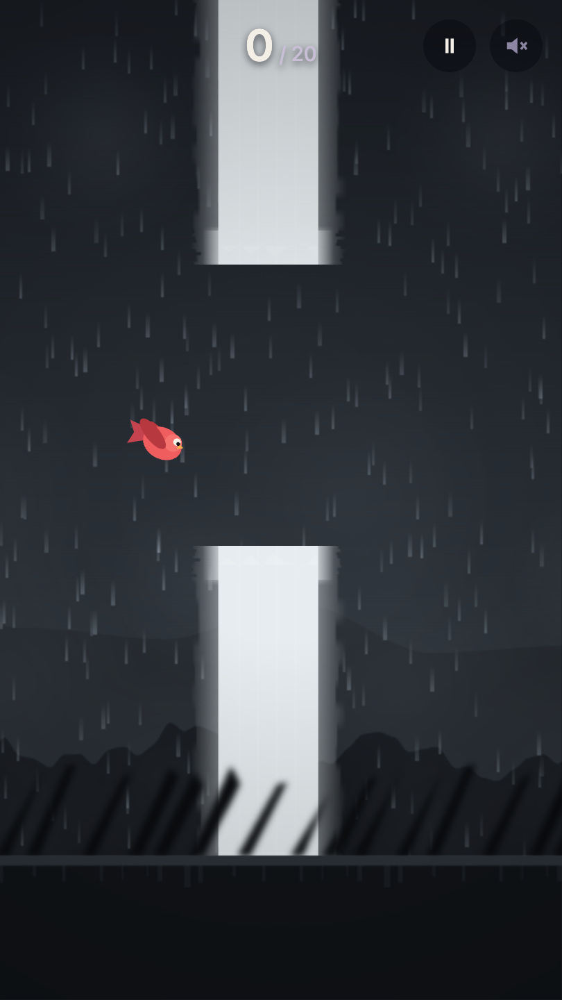
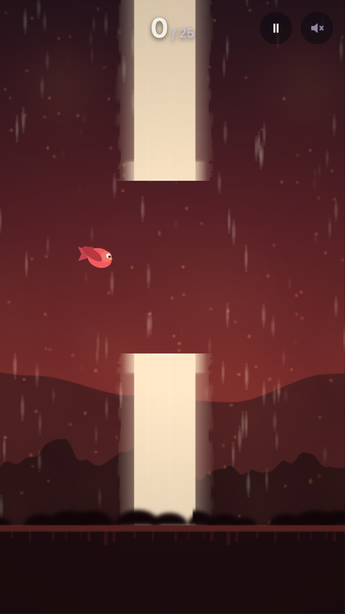
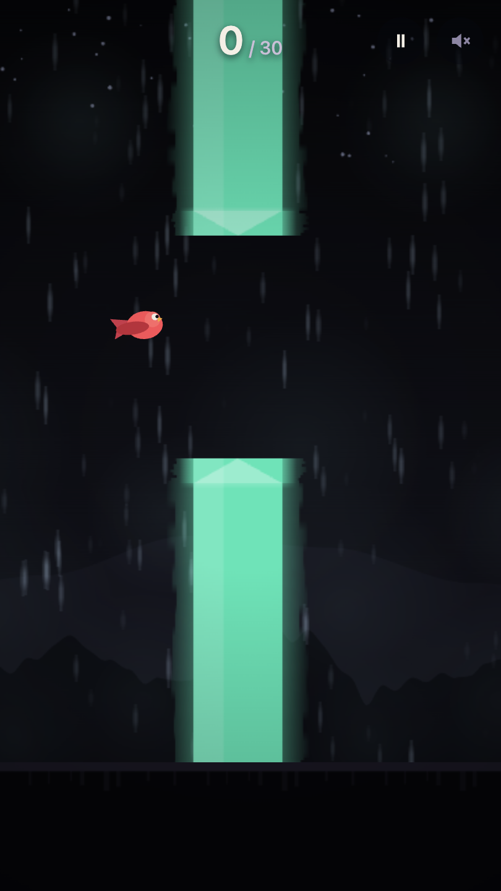

# Duskwing

Аркада в духе flappy-механики: одна кнопка, пять уровней с целями и бесконечный режим
после прохождения. Ни одного бинарного ассета — небо, гребни, дымка, погода, препятствия
и сама птица рисуются процедурно при старте.

**Демо:** https://ingvvvar.github.io/duskwing/

Стек: Vite + React + TypeScript (strict) + PixiJS v8. Логика покрыта vitest.

## Уровни

| | | |
|---|---|---|
|  |  |  |
| **Сумерки** — обучение | **Ночь** — быстрее, просвет уже | **Гроза** — трубы ходят по вертикали |

| | |
|---|---|
|  |  |
| **Каньон** — зоны восходящих и нисходящих потоков | **Пустота** — всё сразу, минимальный просвет |

Полосы ветра в «Каньоне» — не украшение фона, а телеграф механики: они идут ровно со
скоростью мира и показывают, где поток снесёт птицу вверх, а где вниз. На «Сумерках»
первые препятствия односторонние — это кривая обучения, а не ошибка рендера: новичок
сначала учится перелетать, потом нырять, и только потом встречает полный просвет.

## Архитектурная граница

`src/game/**` — чистый TypeScript. В нём нет ни одного импорта `react` и `pixi.js`,
нет `Math.random` и нет обращений к часам. Он знает только о числах и о своём состоянии.
Рендер получает это состояние снаружи через интерфейс `Renderer` (`src/game/types.ts`),
и PixiJS — всего лишь одна из его реализаций в `src/render/pixi/`. React живёт в
`src/ui/` и к игровому циклу не подключён: `setState` вызывается на смене счёта и фазы,
а не на каждом кадре.

Что это дало на практике:

- **Логика тестируется без браузера.** 118 тестов идут в node, без jsdom и без единого
  пикселя на экране. Физика, коллизии, раскладка уровней, прогресс — всё это функции от
  чисел.
- **Прогон воспроизводим.** Источник случайности — `mulberry32(seed)`, и `?seed=1234`
  работает в том числе в проде: баг, найденный на конкретной раскладке, повторяется
  один в один. Часы запрещены внутри `src/game/**` именно поэтому.
- **Симуляция не зависит от частоты кадров.** Фиксированный шаг 1/120 с с аккумулятором,
  накопление клампится 250 мс (вкладка ушла в фон), рендер интерполирует между тиками.

**Держится граница не договорённостью, а двумя проверками.** `tests/game-boundary.test.ts`
грепает исходники и падает на запрещённом импорте или обращении к часам;
`no-restricted-imports` в `eslint.config.js` ловит то же самое на этапе линта. Обе
проверки проверены мутациями: протащенный в `src/game` импорт `pixi.js`, импорт `react`,
`Math.random` и `Date.now` — каждый из четырёх ломает набор.

## Чем держится честность игры

Главный инвариант проекта: **плотным на экране может быть только то, что участвует в
коллизии.** Прямоугольник столкновения — всегда 64 px в ширину и цвета `accent` темы.
Всё, что выходит за него — вылет навершия, мягкий контур, декор — обязано читаться
мягким: полупрозрачным, размытым, рваным по краю. Плотная деталь снаружи прямоугольника
означала бы смерть о то, что выглядит проходимым, — худший вид нечестности, какой может
быть в такой игре.

Проверяется этот инвариант **по настоящим пикселям**, командой `npm run check:honesty`,
а не юнит-тестом. Причина в том, что проверять надо результат, а не намерение: юнит-тест
способен закрепить только план рисования — ширину, отступы, альфы, — а на экране окажется
то, что нарисовал исполнитель этого плана, и риск просто переедет в него. Скрипт снимает
по два кадра на каждую из пяти тем на живой сборке и меряет на них ширину плотной полосы:
она обязана укладываться в ширину коллизии плюс допуск на сглаживание. Фактически выходит
59–60 px при коллизии 64. Мягкие поля тем шире допуска в разы, поэтому их прорыв в плотное
он не спрячет.

Тем же замером проверяется контракт читаемости: яркость фона в вертикальной полосе трубы
не выше 45% яркости самой трубы, измеренной на экране — после грейда и виньетки, а не
взятой из цвета темы. По пяти темам выходит от 1.2% до 8.4%.

Рядом стоит второй инвариант: **рисунок препятствия и его коллизия — одна и та же
геометрия.** Формула раскладки вынесена в `src/render/obstacleLayout.ts` и сверяется
тестом с `pipeRects` из логики. Так было не всегда: пул препятствий ставил вертикальную
геометрию один раз при выдаче из пула, а у движущихся труб центр просвета меняется каждый
тик — нарисованный просвет расходился с настоящим на 44 px на третьем уровне и на 48 px
на пятом. Птица умирала о пустоту. Нашлось это сверкой в браузере, а не глазами.

## Запуск

```bash
npm install
npm run dev            # дев-сервер
npm run test           # 118 тестов, node, без браузера
npm run check:honesty  # проверка по пикселям, пять тем, нужен браузер
npm run build          # прод-сборка (внутри — typecheck)
```

Ещё есть `npm run typecheck` и `npm run lint`; сборка в CI запускает все три проверки
до того, как что-либо собирать.

`check:honesty` браузер не скачивает: берётся системный Google Chrome либо путь из
переменной `DUSKWING_CHROME`.

## Как в проекте обращаются с измерениями

Это, пожалуй, главное, что отличает репозиторий от типового портфолио. Три правила,
каждое написано после того, как измерение однажды соврало.

**Синтетический ввод допустим как способ привести игру в нужное состояние, но не как
предмет замера.** Событие, отправленное прямо элементу, минует попадание по слоям.
Замер времени рестарта, сделанный так, показывал 9.8 мс — и был неверен: экран смерти
перекрывал канвас, и живой тап до него вовсе не доходил. Всё, где предмет замера — сам
ввод, меряется кликом по координате. После починки худшее из пяти прогонов: 190 мс от
смерти до управляемой попытки при бюджете 300.

**На программном рендерере не считают.** Первый прогон производительности дал 41–48 fps,
пока не выяснилось, что браузер рисовал через SwiftShader. Скрипт замера теперь печатает
строку рендерера и отказывается работать, если она софтверная.

**Инструменту верят только после контролей.** Скрипт замера читаемости за время проекта
соврал четырежды: считал текст подсказки фоном; записывал в фон основание трубы,
перекрытое передним планом; записывал в фон верх трубы, придавленный тяжёлой виньеткой;
и, что хуже всего, молча пропускал кадр, который не смог разобрать, возвращая ноль —
проверка честности могла пройти, ничего не проверив. Врали и соседние инструменты:
счётчик живых текстур считал пустые слоты, а стенд мутационного прогона однажды сообщил,
что ни одна мутация не поймана, — на деле тесты вообще не запускались. Каждый раз это
ловилось контролем, а не чутьём. Сейчас проверка устроена так: подсунь ей заведомо
нарушенную тему — она обязана упасть и назвать кадры; подсунь плотное ядро шире
коллизии — обязана назвать ширину. Оба контроля прогоняются перед тем, как доверять
зелёному результату.

Тесты проверяются тем же способом. Каждый защитный тест в наборе ломался намеренно —
правкой продакшен-кода, которую он обязан поймать. Из 74 таких мутаций 27 в своё время
прошли мимо всего набора: коллизия с нижней половиной трубы не была покрыта ничем, радиус
хитбокса сравнивался не со своим квадратом, поток воздуха мог браться в экранной
координате вместо мировой. Дыры закрыты, и каждая закрыта не словами «написал тест», а
повторным прогоном той же мутации.

## Производительность

Draw-call на кадр по пяти темам: медиана 8–10, максимум 15. Одновременно активных
фильтров не больше двух в геймплее (четыре на замороженном экране перехода между
уровнями), частиц не больше 400, `TilingSprite` не больше шести.

Числа fps здесь намеренно не приводятся. Собственная стоимость кадра у игры лежит **ниже
порога чувствительности стенда**: на самой тяжёлой теме распределение времени кадра не
отличается от пустой страницы в том же браузере и не реагирует на шестикратное замедление
процессора. Любое «60 fps» в таких условиях было бы числом про браузер, а не про игру.
